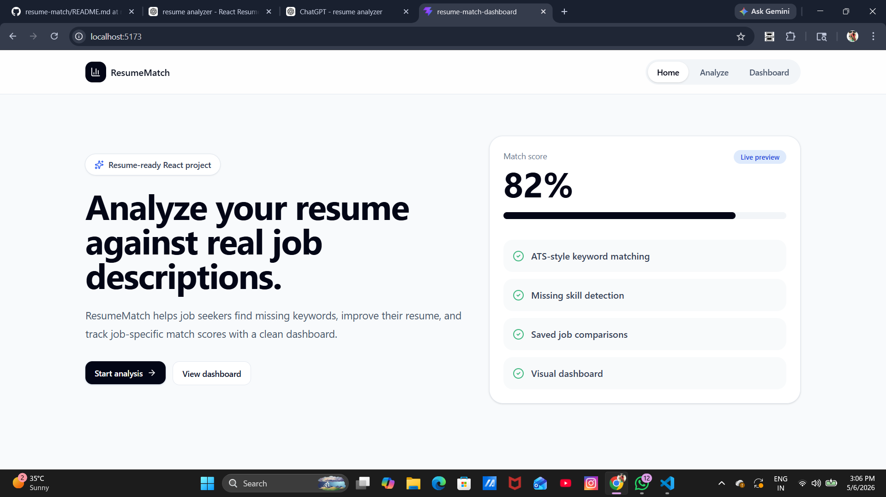
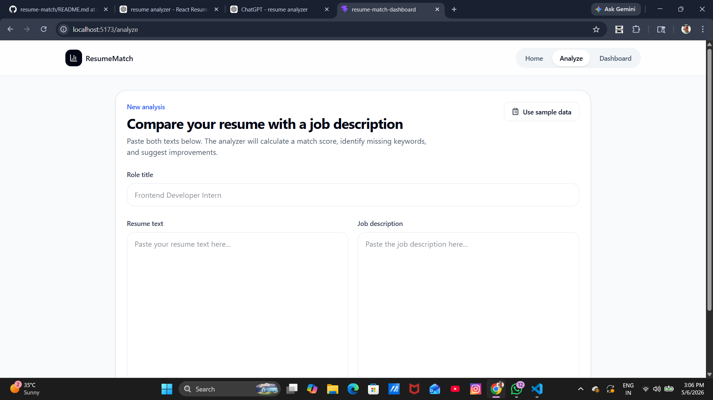
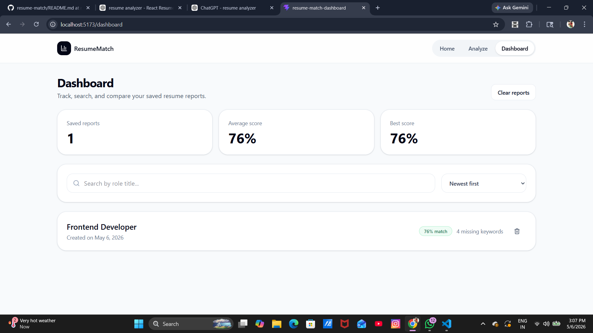

# AI Resume Analyzer & Job Match Dashboard

A modern React + TypeScript web app that compares a resume against a job description, calculates an ATS-style match score, identifies missing keywords, and visualizes skill gaps through a clean dashboard.

This project was built as a resume-worthy frontend project to demonstrate real-world React skills, reusable component design, client-side state management, data visualization, and polished UI/UX.

---

## Features

- Resume and job description comparison
- ATS-style keyword match score
- Missing keyword detection
- Matched keyword detection
- Skill category breakdown chart
- Resume improvement suggestions
- Score explanation section
- Saved analysis dashboard
- Search saved reports by role title
- Sort reports by newest, oldest, highest score, or lowest score
- Delete individual saved reports
- Clear all saved reports
- Use sample data for quick demos
- Export analysis report as PDF using browser print
- Persistent local storage with Zustand
- Responsive SaaS-style UI

---

## Tech Stack

- React
- TypeScript
- Vite
- Tailwind CSS
- React Router
- Zustand
- Recharts
- Lucide React
- LocalStorage

---

## Screenshots

Add your screenshots here after running the app.

```md



```

---

## Getting Started

Clone the repository:

```bash
git clone https://github.com/YOUR_USERNAME/resume-match-dashboard.git
cd resume-match-dashboard
```

Install dependencies:

```bash
npm install
```

Start the development server:

```bash
npm run dev
```

Open the app in your browser:

```bash
http://localhost:5173
```

---

## Build for Production

```bash
npm run build
```

Preview the production build:

```bash
npm run preview
```

---

## Project Structure

```txt
src/
├── app/
│   ├── App.tsx
│   └── routes.tsx
├── components/
│   ├── analyzer/
│   │   ├── AnalyzerForm.tsx
│   │   ├── KeywordList.tsx
│   │   ├── MatchSummary.tsx
│   │   ├── ScoreExplanation.tsx
│   │   ├── SkillChart.tsx
│   │   └── SuggestionsList.tsx
│   ├── common/
│   │   ├── Badge.tsx
│   │   ├── Button.tsx
│   │   ├── Card.tsx
│   │   └── EmptyState.tsx
│   └── layout/
│       ├── AppLayout.tsx
│       └── Navbar.tsx
├── data/
│   └── skills.ts
├── features/
│   └── analyzer/
│       ├── analyzer.store.ts
│       ├── analyzer.types.ts
│       └── analyzer.utils.ts
├── pages/
│   ├── DashboardPage.tsx
│   ├── HomePage.tsx
│   ├── NewAnalysisPage.tsx
│   └── ResultsPage.tsx
├── utils/
│   ├── date.ts
│   └── text.ts
├── index.css
└── main.tsx
```

---

## How It Works

The app compares keywords from the job description with keywords found in the resume.

The analyzer checks skill-related terms across categories such as:

- Frontend
- Backend
- Tools
- Soft skills

Based on the number of matched and missing keywords, it calculates a match score and generates improvement suggestions.

---

## Main Pages

### Home Page

A polished landing page that introduces the product and explains its value.


### Analyzer Page

Users can paste their resume and job description, or use sample data to quickly test the app.

### Results Page

Displays:

- Match score
- Matched keywords
- Missing keywords
- Score explanation
- Skill category chart
- Resume improvement suggestions
- Export PDF option

### Dashboard Page

Displays saved reports with:

- Average score
- Best score
- Search
- Sorting
- Delete actions
- Clear all reports

---

## Key Implementation Details

### State Management

Zustand is used to manage saved resume analyses.

The data is persisted in localStorage, so saved reports remain available after refreshing the browser.

### Routing

React Router is used for page navigation between:

```txt
/
 /analyze
 /results/:analysisId
 /dashboard
```

### Styling

Tailwind CSS is used for a modern responsive UI with:

- Rounded cards
- Soft shadows
- Clean spacing
- Dashboard layout
- Mobile-friendly design

### Charts

Recharts is used to visualize matched and missing skills by category.

---

## What I Learned

While building this project, I practiced:

- Creating a scalable React folder structure
- Building reusable UI components
- Managing global state with Zustand
- Persisting data with localStorage
- Creating custom text-analysis logic
- Designing dashboard interfaces
- Working with charts using Recharts
- Building responsive layouts with Tailwind CSS
- Structuring Git commits professionally

---

## Future Improvements

- PDF resume upload
- AI-powered resume suggestions
- Authentication
- Supabase database integration
- User accounts
- Dark mode
- Unit tests
- Resume section scoring
- Job application tracker
- Export report as a styled PDF file
- Better NLP-based keyword extraction

---

## Resume Bullet Points

You can describe this project on your resume like this:

```txt
Built a React and TypeScript resume analyzer that compares resumes against job descriptions, calculates ATS-style match scores, identifies missing keywords, and visualizes skill gaps using a responsive dashboard.
```

```txt
Implemented reusable UI components, persistent Zustand state management, search and sorting functionality, report deletion, and browser-based PDF export for saved resume analyses.
```

```txt
Designed a modern SaaS-style interface with Tailwind CSS, React Router, Recharts, and clean feature-based architecture.
```

---

## Run Checklist

Before pushing changes:

```bash
npm run build
git status
```

If the build passes, commit your README update:

```bash
git add README.md
git commit -m "docs: update project readme"
git push origin master
```

If your branch is `main`, use:

```bash
git push origin main
```
